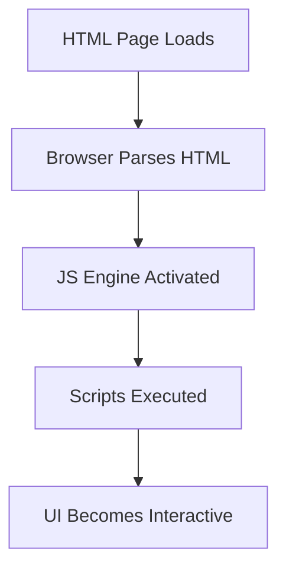

# javascript语法

```js
// 正确导出
export default function MyComponent() {
  return <div>Content</div>;
}

// 正确导入（对应default导出）
import MyComponent from './MyComponent';

```



## 🌍 JavaScript的用途?

* 🌐 **Web Development** – Interactivity in websites
* ⚙️ **Backend Development** – With Node.js
* 🤖 **AI & Machine Learning** – TensorFlow\.js
* 📱 **Mobile App Development** – React Native, Ionic
* 🎮 **Game Development** – Phaser, Three.js
* 🖥️ **Desktop Apps** – Electron.js

🅰️ JavaScript is used everywhere in modern development:

| Area           | Use-Case                                                    |
| -------------- | ----------------------------------------------------------- |
| 🌐 Frontend    | DOM manipulation, animations, SPAs with React, Vue, Angular        |
| 🧠 Backend     | API development with Node.js, Express                       |
| 📱 Mobile Apps | React Native, Ionic for cross-platform apps                 |
| 🤖 AI/ML       | TensorFlow\.js, Brain.js for machine learning in browsers   |
| 🕹️ Game Dev   | HTML5 games, 2D/3D engines (Phaser, Babylon.js)             |
| ⚙️ Dev Tools   | Task runners (Gulp), Linters (ESLint), Bundlers (Webpack)   |
| 🧪 Testing     | Unit and integration testing with Jest, Mocha, Cypress      |